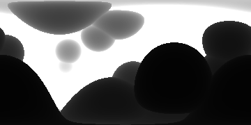
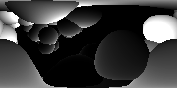

# What Parameters Are Collected?

## Distance

## BB Oritentation

## Distance From Center

## Chain ID

1 if the interesecting sphere is part of the same chain as the source sphere, otherwise -1.
-1 is also returned if the ray does not interest with a sphere,
however that case is treated differently in this picture for the sake of visual clarity. 

The white spheres in the picture are part of the same chain as the source sphere,
the gray spheres are part of a different chain, and
(for the sake of this image)
the background is black.

# Ray Tracing Process

<!-- For more details see [GitHub Flavored Markdown](https://guides.github.com/features/mastering-markdown/). -->
