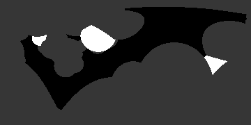

# Overview

MLHOUSE is a neural network that is trained to predict the high-resolution
[Rosetta](https://www.rosettacommons.org) energy of a protein
with [low-resolution](https://www.rosettacommons.org/demos/latest/tutorials/full_atom_vs_centroid/fullatom_centroid) modeling.
In short, each residue in the protein is represented by a single sphere
as opposed to having a sphere for every atom in the residue.

> The PDB 1QYS in the (L) full atom representation, and (R) the centroid representation

MLHOUSE operates by predicting the energy of each surface residue iteratively.
To get the prediction for one residue, MLHOUSE casts rays in all directions
from the center of that residue's centroid sphere.
MLHOUSE performs a simple ray-tracing algorithm to detect the first
centroid sphere (belonging to a different residue) each ray hits.
Instead of deflecting like a normal ray-tracing algorithm,
this ray stops and returns properties about the sphere it hits
(outlines in the nexted section).

MLHOUSE aggregates these ray-tracing results into an image that is fed into a neural network.
The network is trained to predict two properties:
(1) the Rosetta energy of the residue after [performing fixed-backbone rotamer substitution
(packing, can incorporate design)](https://www.rosettacommons.org/demos/latest/tutorials/Optimizing_Sidechains_The_Packer/Optimizing_Sidechains_The_Packer) and
(2) the binding energy _after_ packing is performed in the bound state.

# What Parameters Are Collected?

The following pictures were generated by sampling residue 50
(using Rosetta/absolute numbering, not PDB numbering)
of PDB code 3U3B.

## Distance

Darker objects represent shorter distances.

## BB Oritentation

Black represents being close to the backbone of the sphere,
white represents being on the sidechain end of the sphere.

## Distance From Center

This one is complicated, but it is meant to portray the relationship between the ray and the center of the intersecting sphere.
Black represents a smaller value of Thc (in the picture below) and white is a larger value.

## Chain ID

1 if the interesecting sphere is part of the same chain as the source sphere, otherwise -1.
-1 is also returned if the ray does not interest with a sphere,
however that case is treated differently in this picture for the sake of visual clarity. 

The white spheres in the picture are part of the same chain as the source sphere,
the gray spheres are part of a different chain, and
(for the sake of this image)
the background is black.

## Amino Acid Designability

This image is generated for each of the 20 amino acids.
Residues that can adopt that amino acid identity are colored white,
even if they have a different amino acid identity to start out.
A residue position that can adopt all 20 amino acids will be white in every picture.

# Globe Representation

The pictures shown above are naturally distorted so that the
north and south poles are stretched wide.
Here is a less distorted representation of the distance map:

( [Created at maptoglobe.com](https://www.maptoglobe.com) )

# Accurate Resolution

The pictures above are shown at a higher resolution than MLHOUSE actually samples.
They were generated by sampling both axes with 1 degree resolution (360 x 180),
but the algorithm uses 9 degree resolution (40 x 20) as shown below.

## Distance

## BB Oritentation

## Distance From Center

## Chain ID

# Useful Links
[Rosetta's Full Atom Representation vs Centroid Representation](https://www.rosettacommons.org/demos/latest/tutorials/full_atom_vs_centroid/fullatom_centroid)

[Description of the ray tracing algorithm used](https://www.scratchapixel.com/lessons/3d-basic-rendering/minimal-ray-tracer-rendering-simple-shapes/ray-sphere-intersection)

[Ray Tracing in 256 lines of C++](https://github.com/ssloy/tinyraytracer)

<!-- For more details see [GitHub Flavored Markdown](https://guides.github.com/features/mastering-markdown/). -->
