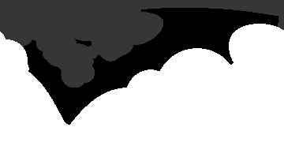

# What Parameters Are Collected?

## Chain ID

1 if the interesecting sphere is part of the same chain as the source sphere, otherwise -1.
-1 is also returned if the ray does not interest with a sphere,
however that case is treated differently in this picture for the sake of visual clarity. 

<!-- For more details see [GitHub Flavored Markdown](https://guides.github.com/features/mastering-markdown/). -->
